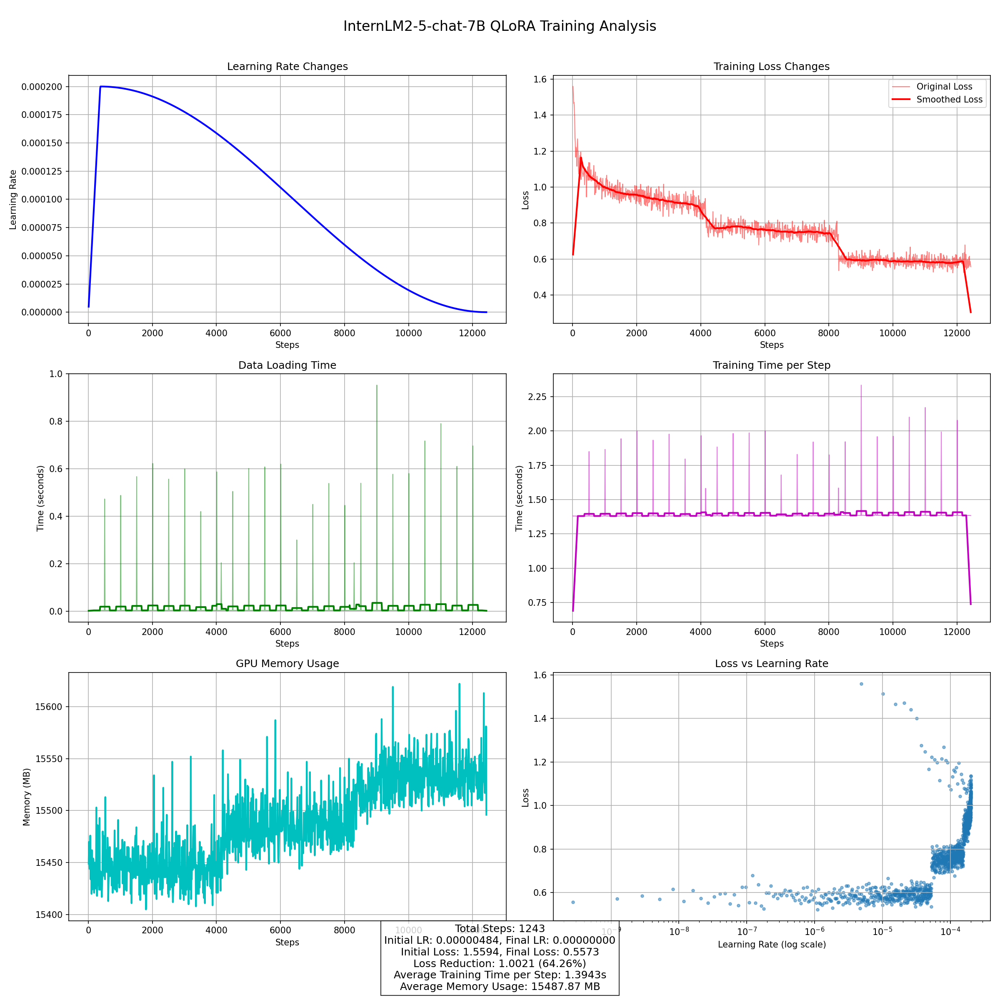

## **Comparative Experiments**

This experiment compares:

1. The model before and after fine-tuning
2. The fine-tuned model against existing large language models in the medical and traditional Chinese medicine (TCM) domains

This experiment investigates the performance impact of fine-tuning by comparing pre-tuning and post-tuning results with existing models in both traditional Chinese medicine (TCM) and general medical domains.

###  Benchmark Details

- **Dataset source:**  [CMMLU Traditional-Chinese-Medicine-Benchmark](https://huggingface.co/datasets/shuyuej/CMMLU-Traditional-Chinese-Medicine-Benchmark)
- **Dataset file:** 
  - [Open-ended question version](./data/test_tcm_benchmark/tcm_benchmark_converted.json)
  - [Single-choice version](./data/test_tcm_benchmark/traditional_chinese_medicine.json)

- **Size:** Contains 185 questions-answers
- **Evaluation method:** Rule-based scoring (model receives credit if its response contains key answer phrases)

###  Model Preparation

- **Base model:** `internlm2_5-7b-chat`
- **Fine-tuning method:** QLoRA
- **Training data:**
  - 1. Source: [ShenNong_TCM_Dataset](https://huggingface.co/datasets/michaelwzhu/ShenNong_TCM_Dataset)(113KQA pairs) -> 2. Quality enhancement: Processed using `deepseek-v3` -> 3. Data file: [Enhanced data file](./data/train_improved_qa/improved_output_converted.json)(16,314 QA pairs)
- **Parameter scale:** All compared models have similar parameter counts
- **Training config file:** [internlm2_5_chat_7b_qlora_tcm.py](./train/internlm2_5_chat_7b_qlora_tcm.py)

#### Training Process

- **Key training metrics**
  - Total training steps: 1243
  - Learning rate: Initial=0.00000484, Max=0.00020000, Final=0.00000000
  - Loss values: Initial=1.5594, Min=0.5230, Final=0.5573
  - Loss reduction: 1.0021 (64.26%)
  - Average training time per step: 1.3943s
  - Average data loading time: 0.0150s
  - Average memory usage: 15487.87 MB
- **Visualization data:**  `./train/20250427_083447/vis_data`

### Experiment Result

|                Model Name                |  Accuracy  |
| :--------------------------------------: | :--------: |
| carebot_medical_multi_llama3-8b-instruct |   61.62%   |
|             huatuo_gpt_2-7b              |   61.08%   |
|             huatuo_gpt_o1-7b             |   83.24%   |
|           internlm2_5-7b-chat            |   78.38%   |
|         internlm2_5-7b-sft(ours)         | **86.49%** |

- The comparative experimental results demonstrate that the fine-tuned model (e.g., `internlm2_5-7b-sft`, 86.49%) achieves outstanding performance in Traditional Chinese Medicine (TCM) tasks. It significantly outperforms other TCM-specific models (e.g., `huatuo_gpt_2-7b`, 61.08%) and general medical models (e.g., `carebot_medical_multi_llama3-8b-instruct`, 61.62%), while matching the performance of the current more advanced TCM reasoning model `huatuo_gpt-o1-7b` (83.24%). This conclusively validates the effectiveness of the fine-tuning approach for TCM knowledge processing tasks.
- **Interaction log:**
  - [carebot_medical_multi_llama3-8b-instruct](./test/log/carebot_medical_multi-llama3-8b-instruct/tcm_benchmark_test_20250427_052457.log)
  - [huatuo_gpt_2-7b](./test/log/huatuo_gpt_2-7b/tcm_benchmark_test_20250427_155408.log)
  - [huatuo_gpt_o1-7b](./test/log/huatuo_gpt_o1-7b/tcm_benchmark_test_20250426_131103.log)
  - [internlm2_5-7b-chat](./test/log/internlm2_5-7b-chat/tcm_benchmark_test_20250427_150517.log)
  - [internlm2_5-7b-sft](./test/log/internlm2_5-7b-sft/tcm_benchmark_test_20250427_153927.log)

## Ablation Study

Compare the performance of **InternLM2-5-7B-SFT** and **InternLM2-5-7B-Chat** on a **traditional Chinese medicine (TCM) benchmark**, evaluating the effects of the following **knowledge-enhanced strategies**:

- **Base model (no augmentation)**
- **Basic RAG (text-only retrieval)**
- **Graph RAG (knowledge-graph-based retrieval)**
- **Hybrid mode (RAG + Graph RAG)**

### Technical Details of RAG and Graph RAG Configurations

- **Graph RAG:**
  - **Knowledge graph search depth**: 3 (traversing up to 3 hops in the graph).
  
  - **Relation frequency-based filtering**: Low-frequency relations are excluded during search to improve relevance.
  
- **RAG Retrieval:**
  - **Hybrid retrieval mode:** Combines **Chroma-based** and **BM25** methods.
  
  - **Weighting:**
    - Chroma-based retrieval: 0.6 (semantic similarity focus).
    - BM25: 0.4 (lexical/sparse retrieval focus).

### Base model:internlm2_5-7b-chat 

|           Model Name           |  Accuracy  | Improvement Over Base | Avg. Response Time |
| :----------------------------: | :--------: | :-------------------: | :----------------: |
| internlm2_5-7b-chat (baseline) |   78.38%   |           -           |       0.28s        |
|             + RAG              |   80.54%   |        +2.16%         |       4.74s        |
|          + Graph RAG           |   82.70%   |        +4.32%         |       4.14s        |
|       + RAG + Graph RAG        | **85.41%** |        +7.03%         |       7.63s        |

### Base model:InternLM2-5-7B-SFT

|          Model Name           |  Accuracy  | Improvement Over Base | Avg. Response Time |
| :---------------------------: | :--------: | :-------------------: | :----------------: |
| internlm2_5-7b-sft (baseline) |   86.49%   |           -           |       0.51s        |
|             + RAG             |   84.32%   |        -2.17%         |       2.18s        |
|          + Graph RAG          |   89.19%   |        +2.70%         |       4.21s        |
|    + RAG + Graph RAG (MCM)    | **89.19%** |        +2.70%         |       3.38s        |

- **Chat Version**: Both RAG and Graph RAG improve performance, with the combined approach yielding the best results (**+7.03%**).
- **SFT Version:**
  - Adding **RAG alone degrades performance** (84.32% vs. 86.49%), likely because SFT has already learned sufficient knowledge, and RAG introduces noise.
  - **Graph RAG** (alone or combined) boosts performance to **89.19%**, demonstrating that structured knowledge (Graph) is more effective than pure retrieval (RAG).
  - **RAG + Graph RAG** does not outperform Graph RAG alone, suggesting that retrieval augmentation may have reached its limit.
  - **Planned Research Directions:**
    - RAG Optimization for SFT Models
      - Investigate **noise reduction** in retrieved documents (e.g., better filtering, reranking, or confidence thresholds).
      - Explore **adaptive RAG**: dynamically disable RAG when the model’s parametric knowledge is sufficient.
- **Interaction log**
  - [internlm2_5-7b-chat](./test/log/internlm2_5-7b-chat/tcm_benchmark_test_20250427_150517.log)
  - [internlm2_5-7b-chat-with-rag](./test/log/internlm2_5-7b-chat-with-rag/tcm_benchmark_test_20250425_154434.log)
  - [internlm2_5-7b-chat-with-graph-rag](./test/log/internlm2_5-7b-chat-with-graph-rag/tcm_benchmark_test_20250427_170950.log)
  - [internlm2_5-7b-chat-with-rag-and-graph-rag](./test/log/internlm2_5-7b-chat-with-rag-and-graph-rag/tcm_benchmark_test_20250427_215137.log)
  - [internlm2_5-7b-sft](./test/log/internlm2_5-7b-sft/tcm_benchmark_test_20250427_153927.log)
  - [internlm2_5-7b-sft-with-rag](./test/log/internlm2_5-7b-sft-with-rag/tcm_benchmark_test_20250427_154243.log)
  - [internlm2_5-7b-sft-with-graph-rag](./test/log/internlm2_5-7b-sft-with-graph-rag/tcm_benchmark_test_20250427_165453.log)
  - [internlm2_5-7b-sft-with-rag-and-graph-rag](./test/log/internlm2_5-7b-sft-with-rag-and-graph-rag/tcm_benchmark_test_20250427_224745.log)